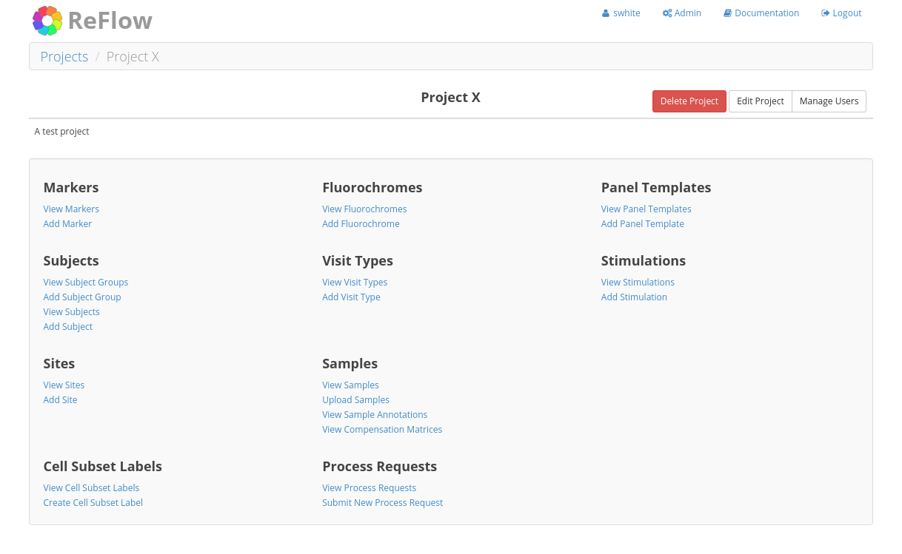
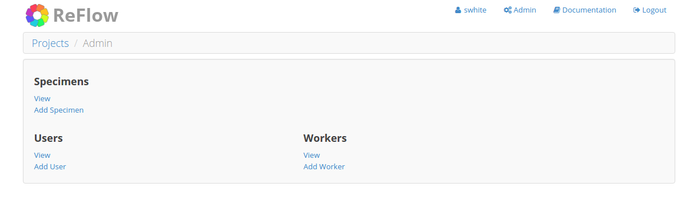

Site Navigation
===============

============
Login Screen
============

Login to the ReFlow server using the web address and user credentials provided by the ReFlow system administrator.

.. image:: images/login.png

=========
Home Page
=========

The home page is a dashboard view of all the projects to which you belong. You will not see any projects to which you do not have view permissions. In the upper right corner of the page you will find your username and a 'Logout' link to log out of the system. Note the 'Documentation' link to access general ReFlow usage documentation. ReFlow administrators will have an additional 'Admin' link to manage administrative tasks such as adding new users.

.. image:: images/home.png
   :width: 1000

==============
Project Detail
==============

The project detail page contains links to all data categories within a project. Note the "breadcrumb" path directly below the ReFlow logo. This area displays your current browsing location, with links to that location's parent pages. There are also links for common actions, such as uploading samples, under each data category.

.. image:: images/project-detail.png
   :width: 1000

.. note:: Some pages within ReFlow display slightly differently depending on user permissions. For example, on the project home page, users with "Manage users" permission for that project will see a "Manage Users" link to the right of the project name. Likewise, users with "Edit project" permission for that project will see an "Edit Project" link.

An admin user would see the project detail view as:

:doc:`tutorials/add-project`

==================
Project Categories
==================

Marker
------

A marker is a property of a cell that can be used to discriminate cell subsets, such as a cell surface or intracellular protein. Typically, one or more markers are utilized in flow cytometry to identify a specific cell population.

Within ReFlow, markers are used to build Panel Template and Sample Annotation parameters. These parameters are mapped to the channels of uploaded FCS files allowing a common naming convention across files from multiple sites or among files from the same site with differing channel labels.

:doc:`tutorials/add-marker`

Fluorochrome
------------

A fluorochrome represents a specific fluorescent chemical (e.g. FITC or AquaAmine). Fluorochromes are typically conjugated to a marker.

Similar to markers, fluorochromes are used to build Panel Template and Sample Annotation parameters, used to map channel labels of uploaded FCS files allowing a common naming convention for all project data.

:doc:`tutorials/add-fluorochrome`

Panel Template
--------------

A panel template is a collection of required parameters that an FCS file must contain in order to be uploaded to a project. A panel template is identified by it's name, which can be any text string. Duplicate panel template names are not allowed within a project. Panel template parameters are defined by a combination of a function, value type, a set of markers, and a fluorochrome.

A parameter function is required and can be one of the following values:

- Forward Scatter
- Side Scatter
- Fluorescence
- Time

Value type is also required and can be one of the following values:

- Height
- Width
- Area
- Time

A parameter may contain zero or more markers, however if no markers are specified, then a fluorochrome is required. Conversely, if no fluorochrome is specified then at least one marker is required. Of course, both markers and a fluorochrome can be specified if a project requires a specific pairing. The list of available markers and fluorochromes are limited to those added to the project. Duplicate parameters are not allowed.

In flow cytometry it is common to have multiple panels that are related. For example, a panel may have a Full Stain variant as well as several fluorescence minus one (FMO) variants, as well as possible Isotype Control or Unstained variants. However, data acquired at a single site for these panel variants will have the same number of channels. ReFlow allows for the creation of panel variant tags to distinguish these files. By default, when a new Panel Template is created a "FULL" tag is created for the Full Stain variant. When creating new variants, a user must choose the variant category and optionally describe which parameter(s) have changed versus the full stain variant.

.. note:: It is important to note that panel templates do not specify the text used for annotating an FCS channel, that is role of the Sample Annotation.

:doc:`tutorials/create-panel-template`

Sample Annotation
-----------------

Flow laboratories often setup their cytometers using their own scheme for identifying channels. For example, some labs may use laser color names (e.g. "Green A", or "Blue B") or simply use numbers to indicate a fluorescence channel (e.g. "FL1", "FL2"). Other labs may use more descriptive labels attempting to describe the markers and/or fluorochromes used. However, even in these cases labs may not use the exact marker or fluorochrome actually used in the experiment, instead using a similar or somewhat equivalent fluorochrome label. This may occur if the user does not have access to change the cytometer labels or simply forgets to update the cytometer settings prior to acquisition. Whatever the reason, inaccurate or ambiguous labelling of FCS channels can lead to problems when analyzing FCS data.

ReFlow attempts to solve this problem through user-guided sample annotation at the time new FCS files are uploaded to the system. A sample annotation maps channel labels in uploaded FCS files to a common naming convention defined by the project's markers and fluorochromes, allowing for the proper identification of parameters present. In addition, there are rules ensuring that the uploaded file contains the required channels in the associated Panel Template.

Sample annotations are constructed from multiple parameters, each using the same functions, value types, markers, and fluorochrome options used to build panel template parameters. The difference is that the channel labels found in the uploaded FCS file are saved along with the user-specified information identifying the parameter. ReFlow retains this information so any subsequent FCS files matching the channel labels of the first file will be detected. If a laboratory acquires all their FCS files for a particular panel with the same set of labels the user will only have to create a sample annotation once for all the files. However, if there are typos or any deviations from the labels, a new sample annotation will be required.

:doc:`tutorials/managing-sample-annotations`

Subject Group
-------------

Subject groups are simply a way to group subjects. There are no rules governing what the subject group represents and the subject group name can be any text string. However, duplicate subject group names are not allowed within a project.

:doc:`tutorials/add-subject-group`

Subject
-------

A subject represents an individual from which a specimen is taken to create an FCS sample. A subject code is required. Subjects may optionally belong to a subject group. A subject can also be marked as a batch control, potentially useful in an automated analysis pipeline.

:doc:`tutorials/add-subject`

Site
----

Sites are locations at which FCS samples are created. There are no rules governing what the site represents, it could be an institution or a particular laboratory. The site name can be any text string, though duplicate site names within a project are not allowed.

There are also various site-level permissions. Users with access to one site within a project will not have access to data in other sites within the project. See :doc:`../permissions` for more information.

.. note:: Sites are not shared across projects. While the same site name may be used in 2 different projects, it is purely coincidental. There is no formal relationship between sites with the same name across different projects, and user permissions are not shared between them.

:doc:`tutorials/add-site`

Visit Type
----------

Visit types can represent any temporal separation of data acquisition within a project. For clinical trials, a visit type may represent subject time points such as a baseline or 3 month follow-up. For proficiency tests, a visit type may represent a specific send out. The visit type name is required and must be unique within a project. The description is optional.

:doc:`tutorials/add-visit-type`

Stimulation
-----------

A stimulation describes the stimulation conditions of a specimen prior to acquiring the FCS sample in order to evaluate activation of cell subsets in intracellular staining (ICS) or proliferation assays. Typically, the stimulant is a pathogen- or cancer-specific mixture of antigenic peptides designed to bind to and activate antigen-specific cells, but non-specific stimulants such as the SEB super antigen may also be used as positive controls.

The stimulation name is required and must be unique within a project. The description is optional. Since the stimulation category is required for uploaded samples, non-stimulated conditions can be represented by any text string such as "Unstimulated", "No stim", or any other preferred text string.

:doc:`tutorials/add-stimulation`

======================
Non-project Categories
======================

Several categories within ReFlow are not defined within projects and their values are shared across all projects. These include:

* Specimens
* Workers

To view or modify data for these categories requires superuser privileges. To navigate to the non-project category views, click on the **Admin** link in the upper right (only available for superusers).

Specimen
--------

A specimen represents a type of biological tissue from which an FCS sample was acquired. There are several specimens included by default in ReFlow, but the list may be modified when deploying a ReFlow server. The default list includes:

====  ===========
Name  Description
====  ===========
BAL   Bronchoalveolar Lavage
BM    Bone Marrow
LNC	  Lymph Node Cells
PBMC  Peripheral Blood Mononuclear Cells
WB    Whole Blood
====  ===========

Worker
------

ReFlow workers are special user accounts used for automated analysis of FCS files. Workers do not have passwords, rather they authenticate to the ReFlow server via token authentication. They are deployed on remote computers with one or more NVIDIA GPUs. See the :doc:`../worker-setup`  for more information about setting up remote workers.