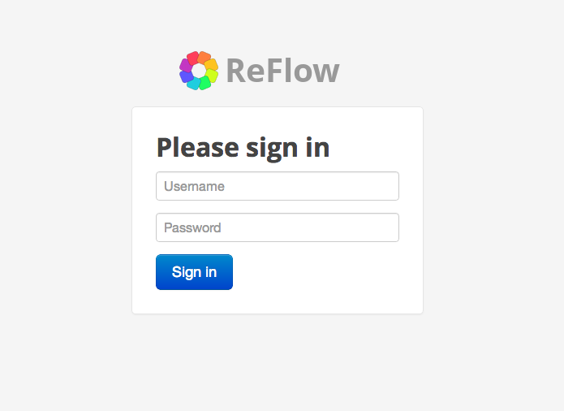
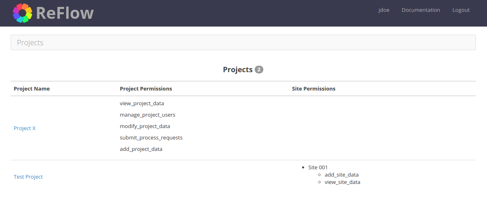
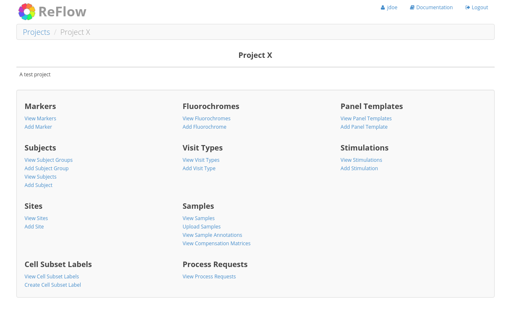
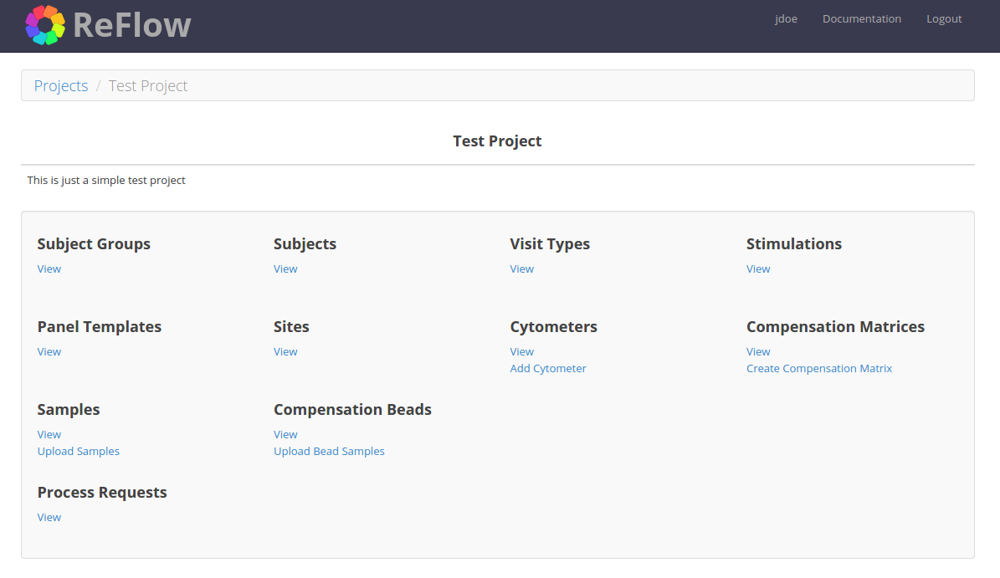

Site Navigation
===============

============
Login Screen
============

Login to the ReFlow server using the web address and user credentials provided by the ReFlow system administrator.

=========
Home Page
=========

The home page is a dashboard view of all the projects to which you belong as well as the user permissions you have for each project. You will not see any projects to which you do not have view permissions. In the upper right corner of the page you will find your username and a 'Logout' link to log out of the system. Note the 'Documentation' link to access general ReFlow usage documentation. ReFlow administrators will have an additional 'Admin' link to manage administrative tasks such as adding new markers, fluorochromes, etc.

==============
Project Detail
==============

The project detail page is a dashboard view with links to all data categories within a project. Some categories are related to others, for example, a particular cytometer belongs to a particular site. Note the "breadcrumb" path directly below the ReFlow logo. This area displays your current browsing location, with links to that location's parent pages. There are also links for the most common actions under each data category.

Note that some pages within ReFlow will be displayed slightly different depending on user permissions. For example, on the project home page, users with "Manage users" permission for that project will see a "Manage Users" link to the right of the project name. Likewise, users with "Edit project" permission for that project will see an "Edit Project" link. A non-admin user would see the project detail view as:

:doc:`tutorials/add-project`

================================
Project Category - Subject Group
================================

Subject groups are simply a way to group subjects. There are no rules governing what the subject group represents and the subject group name can be any text string. However, duplicate subject group names are not allowed within a project.

:doc:`tutorials/add-subject-group`

==========================
Project Category - Subject
==========================

Subjects are individuals from which a specimen is taken to create an FCS sample. Subjects must belong to a subject group, so a subject group must be created before adding subjects. A subject can also be marked as a batch control, a field used in the automated analysis pipeline.

:doc:`tutorials/add-subject`

=======================
Project Category - Site
=======================

Sites are locations at which FCS samples are created. There are no rules governing what the site represents, it could be an institution or a particular laboratory. The site name can be any text string. However, duplicate site names within a Project are not allowed.

Sites are not shared across projects. While the same site name may be found in 2 different projects, it is purely coincidental. There is no formal relationship between those 2 sites, and user permissions are not shared between them.

There are also site-level permissions which restrict access for site users. Users with access to one site within a project will not have access to data in other sites within the project. See :doc:`../permissions` for more information.

:doc:`tutorials/add-site`

======================
Non-project Categories
======================

Several categories within ReFlow are not defined within projects and their values are shared across all projects. These include:

* Specimens
* Markers
* Fluorochromes
* Staining
* Parameter Functions
* Parameter Value Types