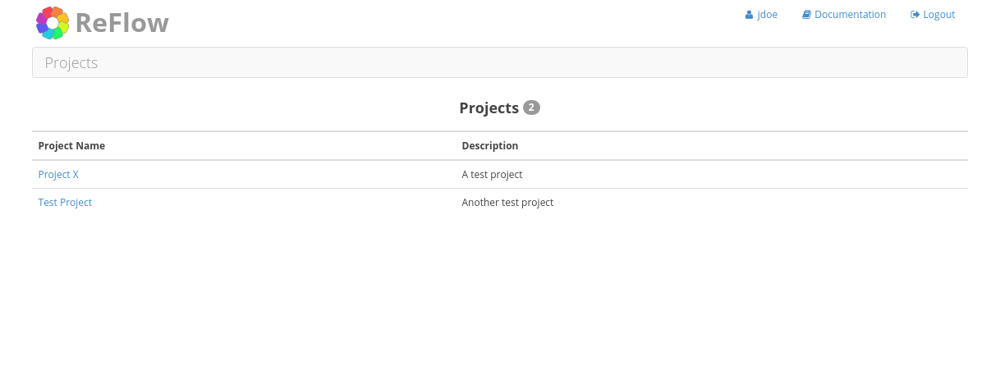

Site Navigation
===============

============
Login Screen
============

Login to the ReFlow server using the web address and user credentials provided by the ReFlow system administrator.

.. image:: images/login.png

=========
Home Page
=========

The home page is a dashboard view of all the projects to which you belong as well as the user permissions you have for each project. You will not see any projects to which you do not have view permissions.

The main logo in the upper left corner will always link back to this home page. In the upper right corner of the page you will find your username and a 'Logout' link to log out of the system. Note, you will be automatically logged off after 15 minutes of inactivity.

============
Project Home
============

The project home page is a dashboard view with links to all data categories within a project. Some categories are related to others, and this is shown by grouping them together, for example a particular cytometer belongs to a particular site, so they are grouped to convey this relationship.

The exception to this is the Sample link. Samples represent individual FCS files and are related to several other categories. Therefore, the link to project samples is not grouped with other categories.

.. image:: images/project-home.png

Note that some pages within ReFlow will be displayed slightly different depending on user permissions. On the project home page, users with "Manage users" permission for that project will see a "Manage Users" link to the right of the project name. Likewise, users with "Edit project" permission for that project will see an "Edit Project" link. Users with both permissions will see both:

.. image:: images/project-home-admin-user.png

================================
Project Category - Subject Group
================================

Subject groups are simply a way to group subjects. There are no rules governing what the subject group represents and the subject group name can be any text string. However, duplicate subject group names are not allowed.

:doc:`tutorials/add-subject-group`
